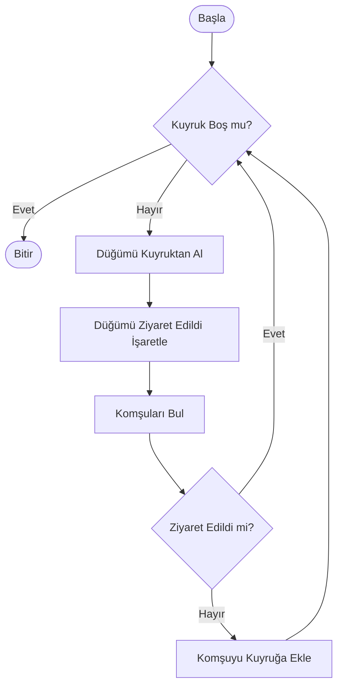
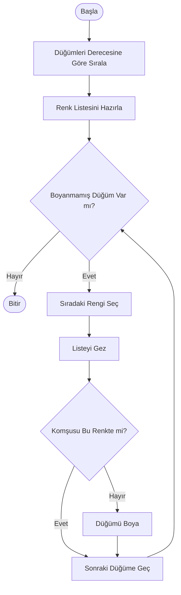
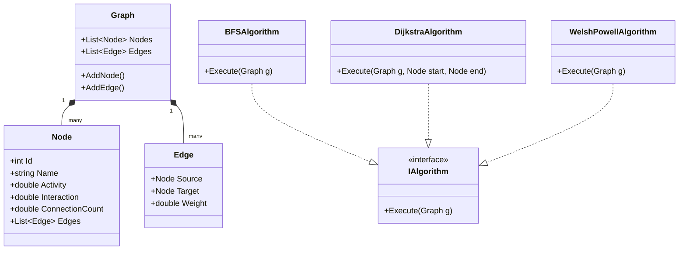
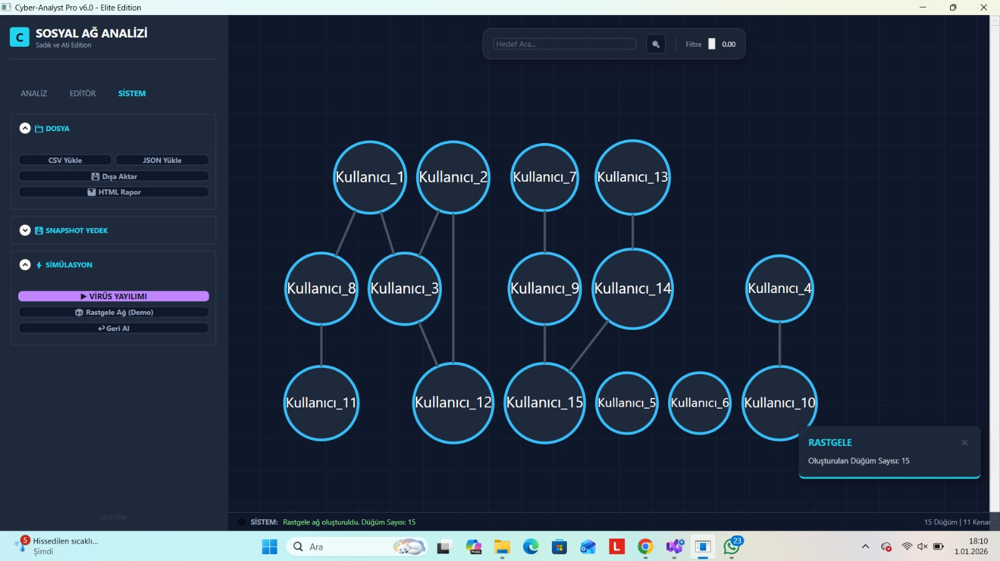
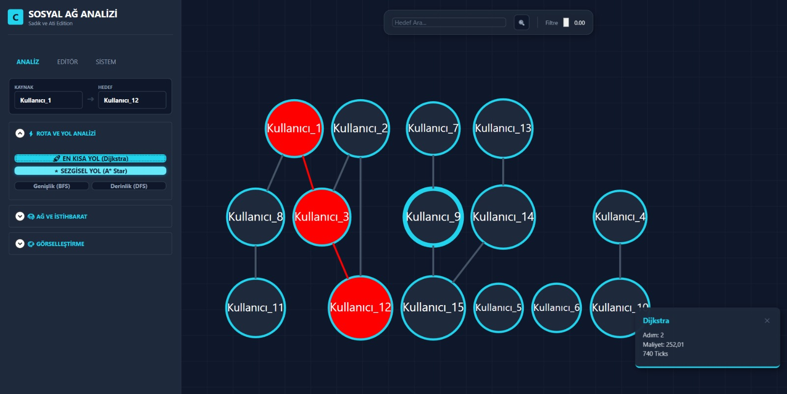
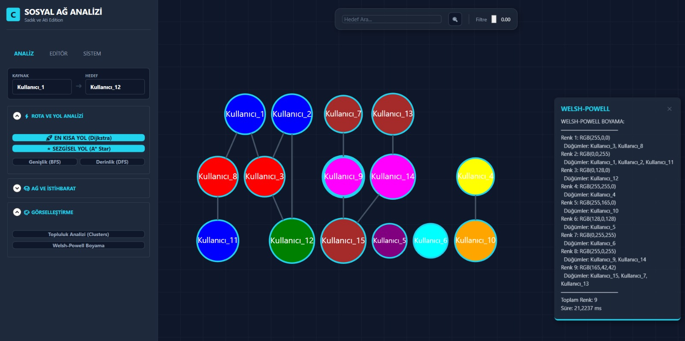

# Sosyal Ağ Analizi (Social Network Analysis)

**Ders:** Kocaeli Üniversitesi - Yazılım Geliştirme Laboratuvarı I (Proje-2)  
**Dönem:** 2025-2026 Güz  
**Teslim Tarihi:** 02 Ocak 2026

## 👥 Ekip Üyeleri

| Ad Soyad | Öğrenci No | GitHub Profil |
|----------|------------|---------------|
| ATAKAN ÇETLİ | 231307088 | [@atakancetli](https://github.com/atakancetli) |
| SADIK GÜNAY | 231307034 | [@sadikgunay](https://github.com/sadikgunay) |

---

## 📑 İçindekiler

1. [Giriş ve Problem Tanımı](#1-giriş-ve-problem-tanımı)
2. [Algoritmalar ve Yöntemler](#2-algoritmalar-ve-yöntemler)
3. [Yazılım Mimarisi (UML)](#3-yazılım-mimarisi-uml)
4. [Uygulama Ekran Görüntüleri ve Testler](#4-uygulama-ekran-görüntüleri-ve-testler)
5. [Sonuç ve Değerlendirme](#5-sonuç-ve-değerlendirme)

---

## 1. Giriş ve Problem Tanımı

Bu proje, kullanıcılar arasındaki ilişkileri bir graf veri yapısı üzerinde modelleyerek sosyal ağ analizini gerçekleştiren bir masaüstü uygulamasıdır. Projenin temel amacı; kullanıcıları **düğüm (node)**, ilişkileri ise **kenar (edge)** olarak temsil ederek, ağ üzerindeki en etkili kişiyi bulma, toplulukları ayırma ve kişiler arası en kısa yolları hesaplamaktır.

Proje, **Nesne Yönelimli Programlama (OOP)** prensiplerine sadık kalınarak **C#** dili ve **WPF** (Windows Presentation Foundation) teknolojisi ile geliştirilmiştir.

---

## 2. Algoritmalar ve Yöntemler

Projede kullanılan tüm algoritmalar `Core` katmanındaki arayüzlerden türetilmiş ve Strategy tasarım desenine uygun geliştirilmiştir.

### 2.1. Dinamik Ağırlık Hesaplama (Weight Calculation)

İki düğüm arasındaki kenar maliyeti (Weight), statik bir değer değildir. Proje isterlerine uygun olarak; kullanıcıların **Aktiflik**, **Etkileşim** ve **Bağlantı Sayısı** özelliklerine göre dinamik hesaplanır. Benzer özelliklere sahip kullanıcıların arasındaki mesafe (maliyet) daha düşüktür.

**Kullanılan Formül:**

$$
Ağırlık_{i,j} = 1 + \sqrt{(Aktiflik_i - Aktiflik_j)^2 + (Etkileşim_i - Etkileşim_j)^2 + (Bağlantı_i - Bağlantı_j)^2}
$$

### 2.2. Ağ Gezme Algoritmaları (BFS & DFS)

Ağ üzerindeki bir düğümden erişilebilen tüm diğer düğümleri tespit etmek için Breadth-First Search (BFS) ve Depth-First Search (DFS) algoritmaları kullanılmıştır.

* **Karmaşıklık:** $O(V + E)$ (V: Düğüm, E: Kenar)

**BFS Akış Şeması:**

### 2.3. En Kısa Yol (Dijkstra ve A*)

İki kullanıcı arasındaki minimum maliyetli yolu bulmak için Dijkstra ve A* algoritmaları entegre edilmiştir. Algoritma, yukarıda belirtilen dinamik ağırlık formülünü maliyet fonksiyonu olarak kullanır.

### 2.4. Merkezilik Analizi (Degree Centrality)

Ağdaki en popüler kullanıcıları belirlemek için "Degree Centrality" yöntemi kullanılmıştır. En çok bağlantıya sahip olan düğümler analiz edilerek, en yüksek dereceli 5 kullanıcı raporlanır.

### 2.5. Renklendirme Algoritması (Welsh-Powell)

Ağdaki ayrık toplulukları ve komşuluk ilişkilerini görsel olarak ayrıştırmak için Welsh-Powell graf renklendirme algoritması kullanılmıştır. Bu algoritma, birbirine komşu olan düğümlerin farklı renklere sahip olmasını garanti eder.

**Welsh-Powell Akış Şeması:**

---

## 3. Yazılım Mimarisi (UML)

Proje, **Katmanlı Mimari (N-Tier Architecture)** kullanılarak tasarlanmıştır. Bu yapı, kodun okunabilirliğini, test edilebilirliğini ve sürdürülebilirliğini artırır. Tüm yapı "Separation of Concerns" prensibine uygundur.

* **Core:** Temel varlıklar (`Node`, `Edge`) ve soyutlamalar (`IGraphService`, `IAlgorithm`).
* **Concrete:** Soyutlamaların gerçeklendiği sınıflar (`GraphManager`).
* **Algorithms:** Algoritmik mantık katmanı (`Dijkstra`, `BFS`, `WelshPowell`).
* **Visualization:** WPF arayüz işlemleri ve Canvas çizimleri.

**Sınıf Diyagramı (Class Diagram):**

---

## 4. Uygulama Ekran Görüntüleri ve Testler

Bu bölümde uygulamanın çalışma zamanına ait ekran görüntüleri ve algoritma test sonuçları yer almaktadır.

*(Not: Proje klasörünüze 'Screenshots' adında bir klasör açarak ilgili resimleri oraya ekleyiniz)*

### 4.1. Ana Ekran ve Veri Yükleme

Uygulama açıldığında `social_network.csv` dosyasından veriler okunur ve graf canvas üzerine çizilir. Düğümler sürüklenebilir yapıdadır.

### 4.2. Düğüm Bilgisi ve Etkileşim

Düğümlerin üzerine tıklandığında, kullanıcının aktiflik ve etkileşim puanlarını gösteren detay penceresi açılır.

### 4.3. En Kısa Yol Testi (Dijkstra)

Seçilen iki düğüm arasındaki en kısa yol hesaplanır ve yol üzerindeki kenarlar belirgin bir renk ile vurgulanır.

### 4.4. Renklendirme Testi (Welsh-Powell)

Algoritma çalıştırıldığında, komşu düğümlerin farklı renklere boyandığı ve görsel ayrıştırmanın sağlandığı görülmektedir.

### 4.5. Performans Sonuçları Tablosu

Aşağıdaki tablo, küçük (15 düğüm) ve orta ölçekli (50 düğüm) graflar üzerinde yapılan test sonuçlarını göstermektedir.

| Graf Boyutu | Algoritma | Süre (ms) | Notlar |
|:---|:---|:---|:---|
| 15 Düğüm (Küçük) | Dijkstra | 2ms | Anlık sonuç |
| 15 Düğüm (Küçük) | Welsh-Powell | 1ms | Anlık sonuç |
| 50 Düğüm (Orta) | Dijkstra | 12ms | Makul süre |
| 50 Düğüm (Orta) | Welsh-Powell | 10ms | Başarılı ayrıştırma |

---

## 5. Sonuç ve Değerlendirme

### Başarılar

* **Modüler Yapı:** Interface ve Strategy deseni kullanılarak yeni algoritmaların eklenmesi kolaylaştırılmıştır. OOP prensiplerine tam uyum sağlanmıştır.
* **Dinamik Hesaplama:** Kullanıcı özelliklerine göre değişen ağırlık sistemi başarıyla entegre edilmiştir.
* **Görselleştirme:** WPF Canvas üzerinde sürükle-bırak desteği ile interaktif bir yapı kurulmuştur.

### Kısıtlar ve Geliştirmeler

* Çok büyük veri setlerinde (10.000+ düğüm) Canvas çizim performansı düşebilmektedir. Gelecek geliştirmelerde GPU tabanlı çizim kütüphaneleri tercih edilebilir.
* Veri kalıcılığı şu an JSON/CSV tabanlıdır, SQL veritabanı entegrasyonu eklenebilir.

---
© 2026 - Kocaeli Üniversitesi Yazılım Geliştirme Laboratuvarı Projesi
